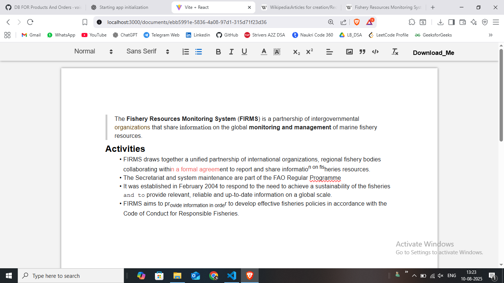

# 📄 doc_editor

A collaborative document editor built with **Quill.js**, **Socket.IO**, **Node.js**, and **MongoDB Atlas**.  
It allows multiple users to edit the same document in real time, with changes synced instantly across all connected clients.

---

## ✨ Features

- Real-time text editing using **Quill.js** rich text editor
- Live updates powered by **Socket.IO**
- Persistent storage with **MongoDB Atlas**
- Backend built using **Node.js** and **Mongoose**
- Multiple users can edit simultaneously
---

## 🛠️ Tech Stack

**Frontend:**
- [React.js](https://reactjs.org/)
- [Quill.js](https://quilljs.com/)
- [Socket.IO Client](https://socket.io/)

**Backend:**
- [Node.js](https://nodejs.org/)
- [Express.js](https://expressjs.com/)
- [Socket.IO](https://socket.io/)
- [Mongoose](https://mongoosejs.com/)
- [MongoDB Atlas](https://www.mongodb.com/atlas)

---
## 📷 Screenshots

> Replace `assets/screenshot1.png` with your actual screenshot paths.

**Editor Interface**


## 🚀 Local Development

Follow these steps to run the project locally.

### 1️⃣ Clone the repository
```bash
git clone https://github.com/vaishnaviparabkar90/Doc_Editor.git
cd doc_editor
```

### 2️⃣ Install dependencies
Backend
```bash
cd server
npm install
```
Frontend:
```bash
cd ../client
npm install
```
### 3️⃣ Set up environment variables
Create a .env file inside the server folder:
env
```bash
MONGO_URI=your_mongodb_atlas_connection_string
PORT=5000
```
### 4️⃣ Start the backend server
```bash
cd server
npm run dev 
```
Server will run on:
http://localhost:5000
 ### 5️⃣ Start the frontend app
```bash
cd ../client
npm start
```
Frontend will run on:
http://localhost:3000